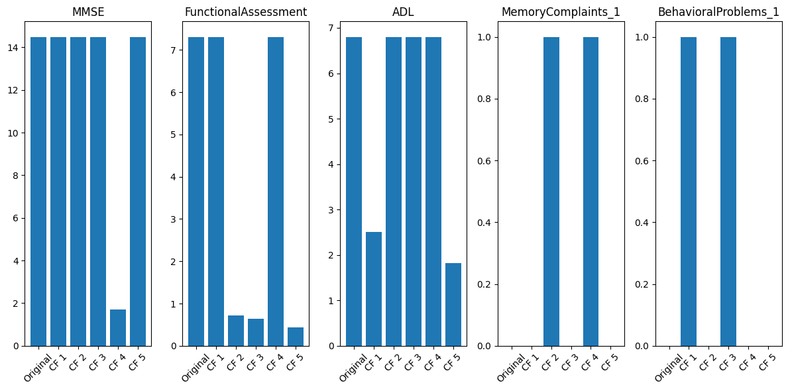
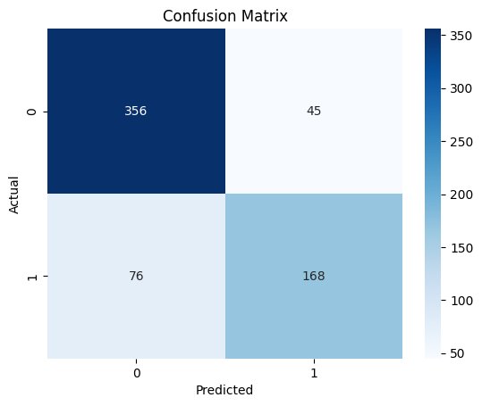
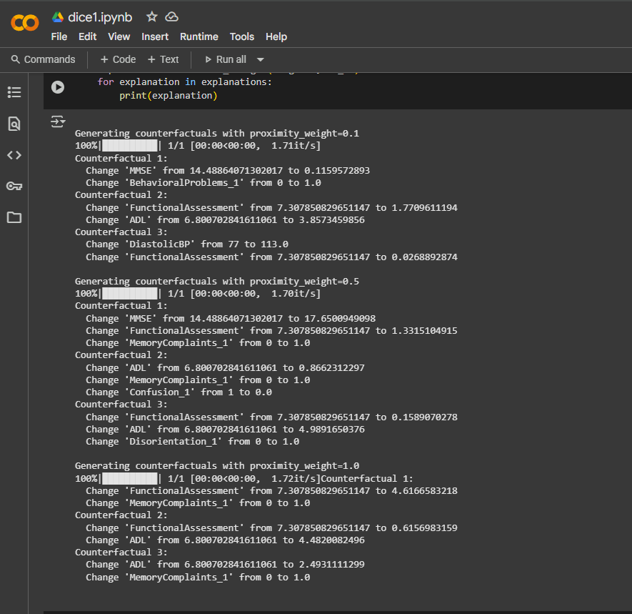

# Diverse Counterfactual Explanations in Machine Learning 🌐🧠

This project explores how to generate **diverse, actionable counterfactuals** to explain predictions from black-box models. It uses a custom implementation of **DiverseCF with Determinantal Point Processes (DPPs)** based on the DiCE library and the foundational paper by Microsoft Research. The counterfactuals are evaluated using key explainability metrics on a real-world Alzheimer's disease dataset.

---

## 📂 Project Structure

- `notebook/dice1.ipynb` – Jupyter notebook implementing DiverseCF + evaluation
- `outputs/` – Screenshots showing CF examples, metrics, and console output

---

## 🧪 Dataset Used

We used the **Alzheimer's Disease Dataset**, which contains clinical and diagnostic data for predicting Alzheimer's. This enables testing counterfactual explanations in a high-impact, real-world scenario.

- 📄 File: `dataset/alzheimers_disease_data.csv`
- 📊 Features: Age, education, MRI scores, MMSE, and more
- 🎯 Target: Demented / Non-Demented
- 🔗 [Kaggle Link](https://www.kaggle.com/datasets/rabieelkharoua/alzheimers-disease-dataset)

> ⚠️ Due to Kaggle's usage policy, the dataset is not uploaded directly. Users may download it from the link above.

---

## 🧠 About DiCE and the Research Paper

This project is inspired by the paper:  
**"Explaining Machine Learning Classifiers through Diverse Counterfactual Explanations"**  
*by Mothilal, Sharma (Microsoft Research India), and Tan (University of Colorado Boulder)*  
🔗 [ACM Paper Link](https://doi.org/10.1145/3351095.3372850)

We used the **DiCE (Diverse Counterfactual Explanations)** library by Microsoft Research to generate counterfactuals. DiCE supports:
- Generating **multiple diverse counterfactuals**
- Applying **Determinantal Point Processes (DPPs)** to avoid repetitive outputs
- Respecting **causal constraints and feature immutability**
- Model-agnostic integration (works with scikit-learn, TensorFlow, etc.)

In our project:
- We **trained a classifier** on the Alzheimer’s dataset
- Used DiCE to **generate and evaluate counterfactuals**
- Analyzed them using **validity, proximity, sparsity, and diversity**
- **Visualized results** with plots and text-based outputs

This implementation demonstrates the paper’s central idea:  
✅ Counterfactuals should be **valid**, **sparse**, **proximal**, and **diverse** — not just different, but **meaningfully and realistically different**.

---

## 📊 Evaluation Metrics

- **Validity** – Do the CFs change the prediction?
- **Proximity** – How close is a CF to the original input?
- **Sparsity** – How few features are changed?
- **Diversity** – How distinct are the generated CFs?

---

## 🖼️ Output Visualizations

| Output | Description |
|--------|-------------|
|  | 📊 Feature-wise bar chart showing 5 diverse CFs |
|  | 📈 Metric comparison: validity, proximity, sparsity, diversity |
|  | 🧾 Console output showing CFs at different proximity weights |

---

## 🔍 Use Cases

- Explainable AI in healthcare diagnostics  
- Auditing model fairness and transparency  
- Developing user-friendly interpretable ML systems  
- Research in XAI, causality, and responsible AI

---

## 👨‍💻 Author

**Roshan A Rauof**  

---

